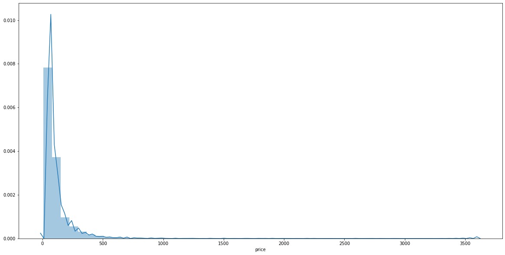
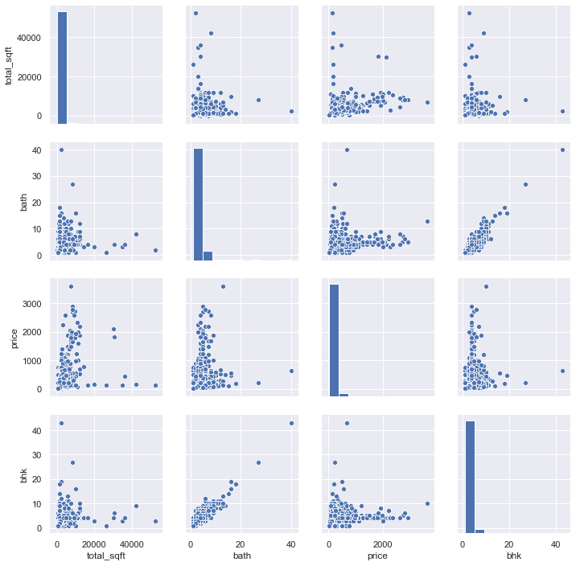
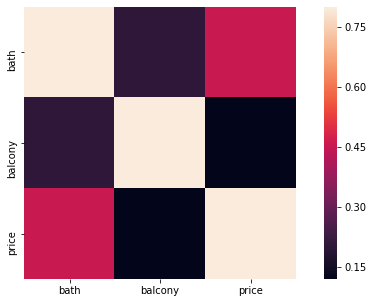

# Predicting Bangalore Home Prices
# Summary

1. Created a tool that calculates and predicts home prices based on various features.
2. Based on the public release data available on Kaggle, the features are employed.
3. Engineered features to calculate dependencies of the target variable on the independent variables.
4. Optimized Linear, Lasso and  Decision Tree regressor using GridSearchCV to reach best model.
5. Achieved an accuracy of 90.62% in correctly predicting the outcome.

Some of the major factors include price, number of bedrooms , bathrooms, location, etc… By correlating the different features we can arrive on a decision based on the prediction. Since the output here is continuous therefore it is termed as a regression problem.

The target variable price depends on numerous features but we can identify it's distribution by visualizing.

# Relationship between various features

By determining the correlation between the variables we can analyse the dependency as well as the correlation.
A classification model attempts to draw some conclusion from observed values. Given one or more inputs a classification model will try to predict the value of one or more outcomes.

Popular algorithms that can be used for regression include:
1. Linear Regression
2. Lasso regression
3. Decision Tree regressor

After deploying the various regression algorithms and using GridSearchCV to determine the optimal parameters we conclude-
Linear regression works the best with an accuracy of 90.62%
